# Web Component Dev Tools

A tool that allows you to inspect and debug web components in your app.


## Features
- View attributes, properties, public methods, slots, css variables, nested components.
- Show overlay of components on the page.
- Monitor events and viewing custom event detail objects.
- Check for accessibility issues.
- Check for component re-renders.

## Packages

| Package | Description | Version |
|---------|-------------|---------|
| [@cadamsdev/vite-plugin-wc-devtools](./packages/vite-plugin) | Vite plugin |  |
| [@cadamsdev/webpack-plugin-wc-devtools](./packages/webpack-plugin) | Webpack plugin |  |
| [@cadamsdev/wc-devtools-client](./packages/client) | Client-side script |  |

## Screenshots

<details>
<summary>Click to view screenshots</summary>

### Panel Overview


### Panel Open
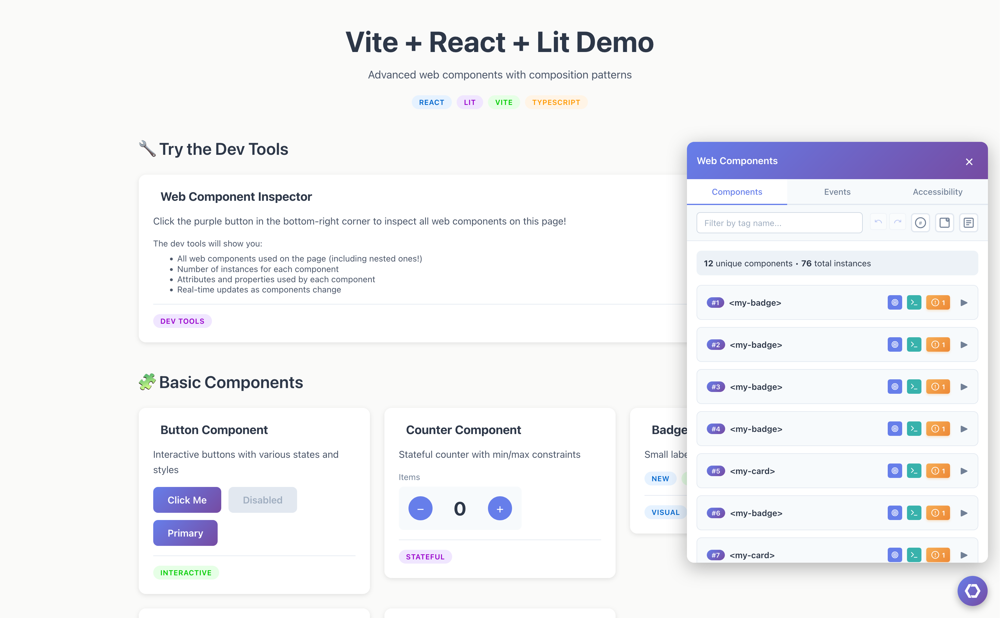

### Component Details
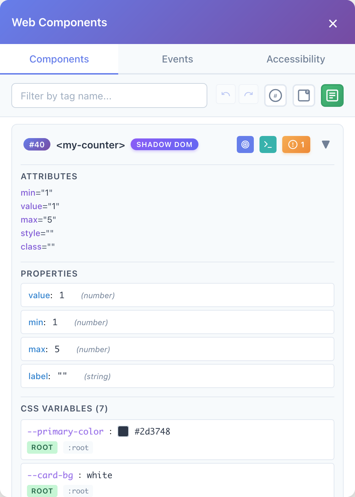

### Component Details with Nested Components
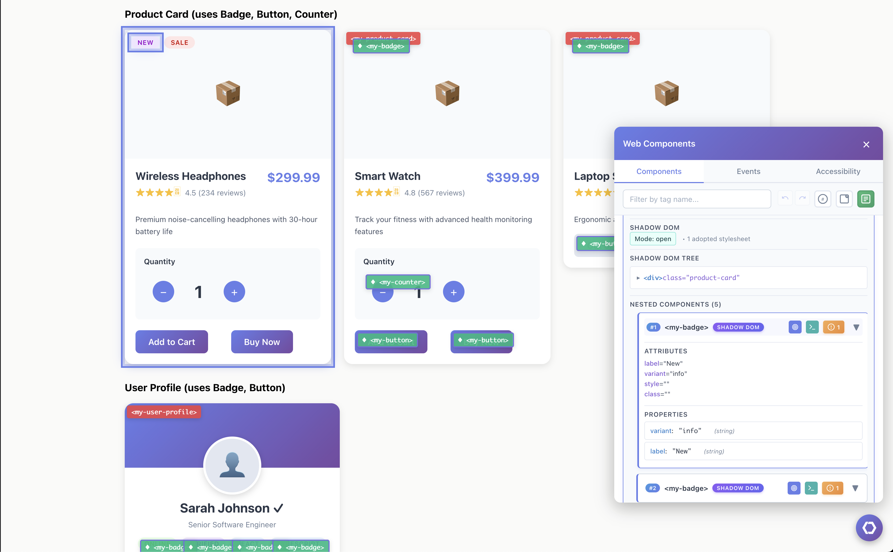

### Component Overlays
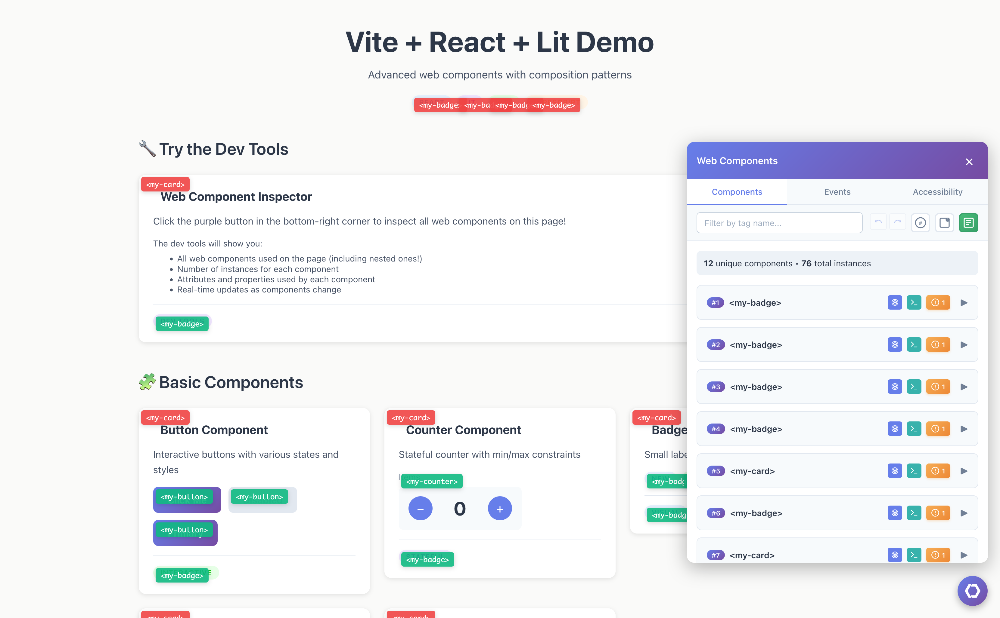

### Highlight Component
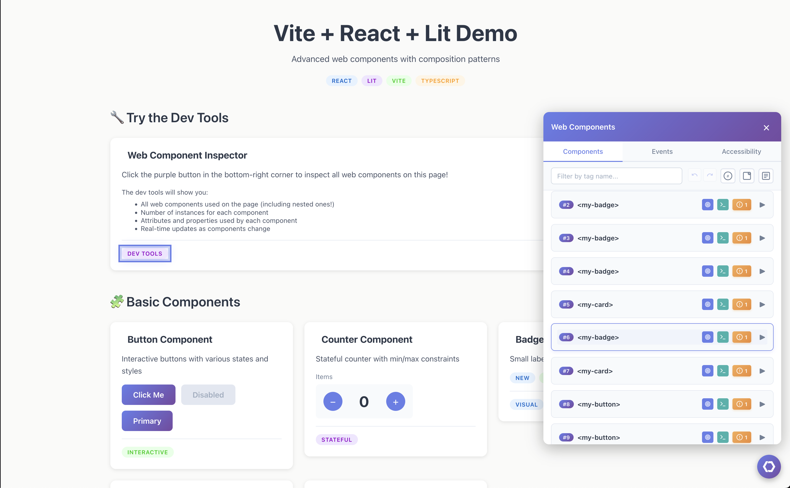

### Log Element to Console
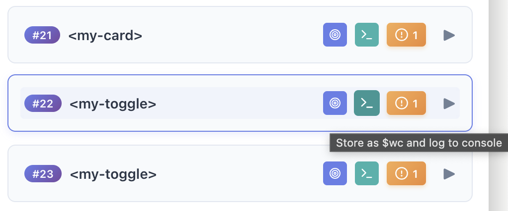

### Monitor Events
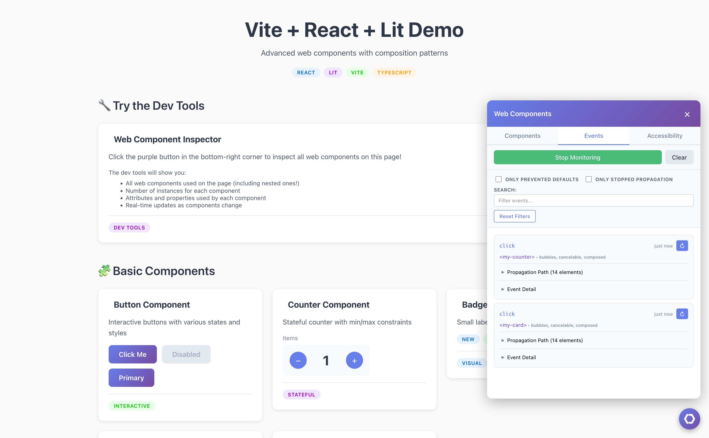

### Scroll to Element
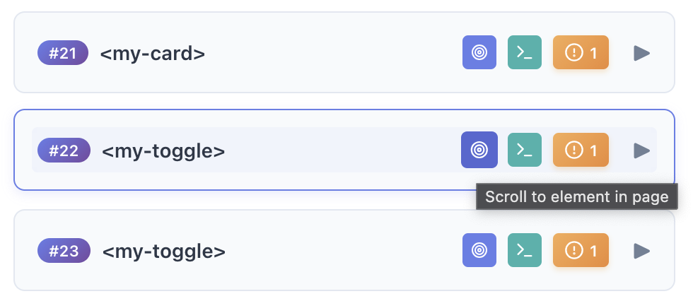

### Shadow DOM Indicator, Overlay and Badge
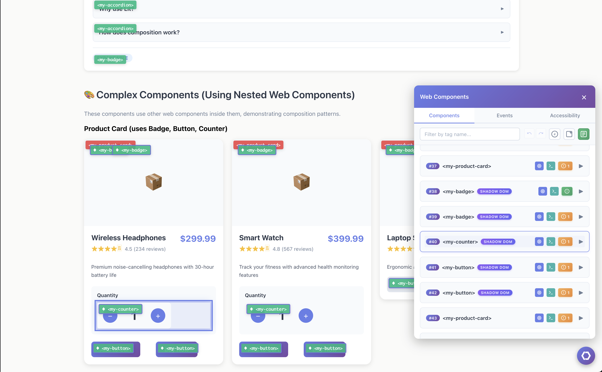

### View Accessibility Issues
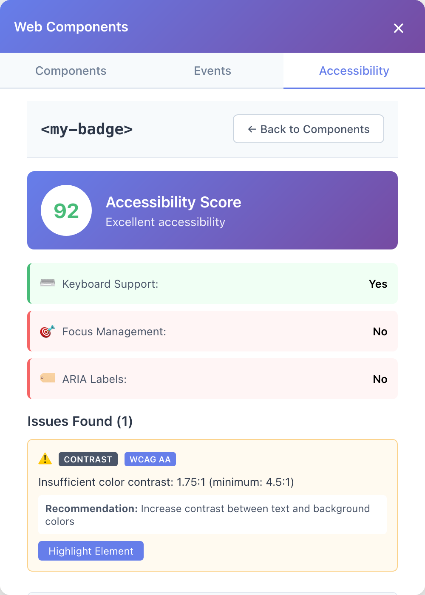

### View Re-renders
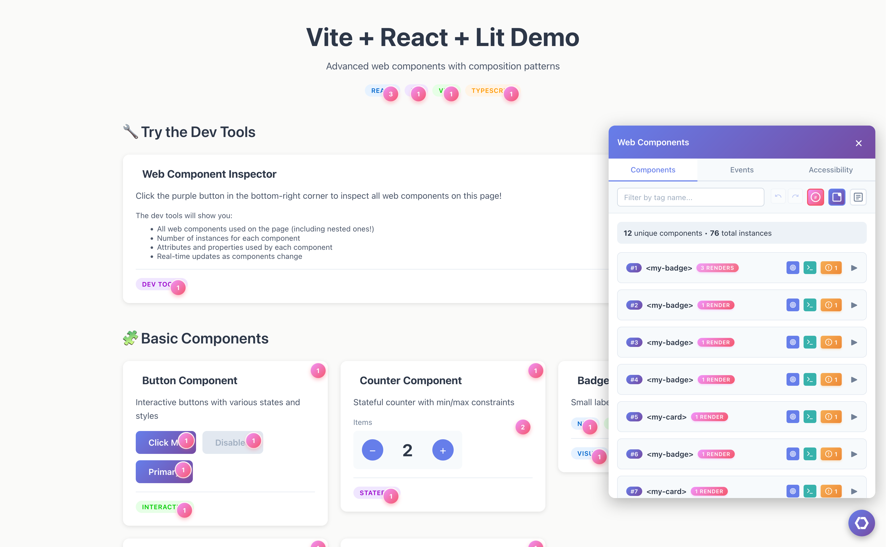

</details>

## ❤️ Sponsors

Support development by becoming a sponsor! Your avatar or company logo will appear below.

[Become a Sponsor](https://github.com/sponsors/cadamsdev)

<!-- Sponsors will appear here -->

## Quick Start

### Vite

```bash
npm install @cadamsdev/vite-plugin-wc-devtools --save-dev
```

```typescript
// vite.config.ts
import { defineConfig } from 'vite';
import { webComponentDevTools } from '@cadamsdev/vite-plugin-wc-devtools';

export default defineConfig({
  plugins: [webComponentDevTools()],
});
```

### Webpack

```bash
npm install @cadamsdev/webpack-plugin-wc-devtools --save-dev
```

```javascript
// webpack.config.js
import { WebpackWebComponentDevTools } from '@cadamsdev/webpack-plugin-wc-devtools';
import HtmlWebpackPlugin from 'html-webpack-plugin';

export default {
  mode: 'development',
  plugins: [
    new HtmlWebpackPlugin({
      template: './src/index.html'
    }),
    new WebpackWebComponentDevTools()
  ]
};
```

## License

[MIT](./LICENSE)
